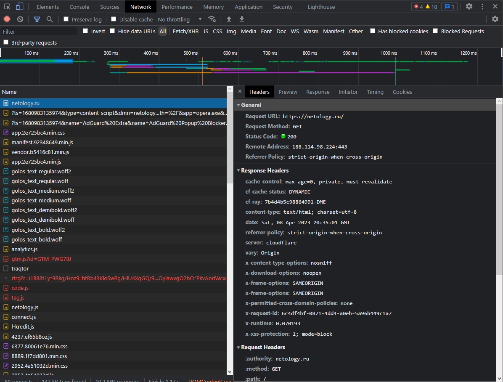

# devops-netology  

Тестовый репозиторий для DevOps  

# Файлы и директроии, которые будут игнорированы

- Локальные директории Terraform  
- Файлы .tfstate, хранящие информацию об инфраструктуре  
- Логи отказов (crash.log, crash.*.log)  
- Файлы .tfvars, которые могут содержать конфиденциальную информацию (пароли, приватные ключи и т.д)  
- Файлы переопределения конфигурации (override.tf, override.tf.json и т.д.)  
- Файлы конфигурации командной строки (.terraformrc, terraform.rc)  

# Домашнее задание к занятию «Инструменты Git»

1. 
> Найдите полный хеш и комментарий коммита, хеш которого начинается на aefea.

` Команда: git show aefea`

    Ответ: 
    
    commit aefead2207ef7e2aa5dc81a34aedf0cad4c32545 Update CHANGELOG.md
    

2. Ответьте на вопросы

 > Какому тегу соответствует коммит 85024d3?

`Команда: git show 85024d3`

    Ответ: 
    
    v0.12.23

 > Сколько родителей у коммита b8d720? Напишите их хеши.

`Команда: git show b8d720^`

    Ответ: 2 родителя

    commit 56cd7859e05c36c06b56d013b55a252d0bb7e158
    commit b8d720f8340221f2146e4e4870bf2ee0bc48f2d5

>  Перечислите хеши и комментарии всех коммитов, которые были сделаны между тегами v0.12.23 и v0.12.24.

`Команда: git log v0.12.24...v0.12.23 --pretty=oneline`

    Ответ:

    33ff1c03bb960b332be3af2e333462dde88b279e (tag: v0.12.24) v0.12.24
    b14b74c4939dcab573326f4e3ee2a62e23e12f89 [Website] vmc provider links
    3f235065b9347a758efadc92295b540ee0a5e26e Update CHANGELOG.md
    6ae64e247b332925b872447e9ce869657281c2bf registry: Fix panic when server is unreachable
    5c619ca1baf2e21a155fcdb4c264cc9e24a2a353 website: Remove links to the getting started guide's old location
    06275647e2b53d97d4f0a19a0fec11f6d69820b5 Update CHANGELOG.md
    d5f9411f5108260320064349b757f55c09bc4b80 command: Fix bug when using terraform login on Windows
    4b6d06cc5dcb78af637bbb19c198faff37a066ed Update CHANGELOG.md
    dd01a35078f040ca984cdd349f18d0b67e486c35 Update CHANGELOG.md
    225466bc3e5f35baa5d07197bbc079345b77525e Cleanup after v0.12.23 release

>  Найдите коммит, в котором была создана функция func providerSource, её определение в коде выглядит так: func providerSource(...) (вместо троеточия перечислены аргументы).

`Команда: git log -S "func providerSource"`

    Ответ: 
    
    commit 8c928e83589d90a031f811fae52a81be7153e82f

>  Найдите все коммиты, в которых была изменена функция globalPluginDirs.

`Команда: git grep -e "globalPluginDirs"`

`Команда: git log -L :globalPluginDirs:plugins.go`

    Ответ: 

    78b1220558 Remove config.go and update things using its aliases
    52dbf94834 keep .terraform.d/plugins for discovery
    41ab0aef7a Add missing OS_ARCH dir to global plugin paths
    66ebff90cd move some more plugin search path logic to command
    8364383c35 Push plugin discovery down into command package

>  Кто автор функции synchronizedWriters?

`Команда: git log -S "synchronizedWriters"`

    Ответ:

    Author: Martin Atkins <mart@degeneration.co.uk>

# Домашнее задание к занятию "3.6. Компьютерные сети, лекция 1" 

__Шаг 1. Работа c HTTP через telnet.__

- Подключитесь утилитой telnet к сайту stackoverflow.com:
telnet stackoverflow.com 80

- Отправьте HTTP-запрос:

        Trying 151.101.193.69...
        Connected to stackoverflow.com.
        Escape character is '^]'.
        GET /questions HTTP/1.0
        HOST: stackoverflow.com

        HTTP/1.1 403 Forbidden
        Connection: close
        Content-Length: 1923
        Server: Varnish
        Retry-After: 0
        Content-Type: text/html
        Accept-Ranges: bytes
        Date: Sat, 08 Apr 2023 20:02:03 GMT
        Via: 1.1 varnish
        X-Served-By: cache-fra-eddf8230108-FRA
        X-Cache: MISS
        X-Cache-Hits: 0
        X-Timer: S1680984123.237463,VS0,VE2
        X-DNS-Prefetch-Control: off

- Stackoverflow блокирует подключения с любого IP и возвращает код 403 Forbidden (доступ к запрошенному ресурсу запрещен), по-этому для этого задания я буду использовать сайт Нетологии

        telnet netology.ru 80
        Trying 188.114.98.224...
        Connected to netology.ru.
        Escape character is '^]'.
        Connection closed by foreign host.
        root@devops:~# telnet netology.ru 80
        Trying 188.114.99.224...
        Connected to netology.ru.
        Escape character is '^]'.
        GET /questions HTTP/1.0
        HOST: netology.ru

        HTTP/1.1 301 Moved Permanently
        Date: Sat, 08 Apr 2023 20:12:00 GMT
        Connection: close
        Cache-Control: max-age=3600
        Expires: Sat, 08 Apr 2023 21:12:00 GMT
        Location: https://netology.ru/questions
        Server: cloudflare
        CF-RAY: 7b4d29a90d06005c-DME
        Alt-Svc: h3=":443"; ma=86400

        Connection closed by foreign host.

В данном случае, возвращается код 301 Moved Permanently - редирект с HTTP на HTTPS

__Шаг 2. Повторите задание 1 в браузере, используя консоль разработчика F12:__

Дольше всего брабатывается Get-запрос (16.29 s)

        Request URL: https://u.netology.ru/backend/uploads/page_assets/videos/file/29342/220118_EDIT_NETOLOGIA_mix__1__2_1.mp4

__Шаг 3. Какой IP-адрес у вас в интернете?__

178.34.1*1.**

__Шаг 4. Какому провайдеру принадлежит ваш IP-адрес? Какой автономной системе AS?__

    descr: ROSTELECOM NETS
    origin: AS12389

__Шаг 5. Через какие сети проходит пакет, отправленный с вашего компьютера на адрес 8.8.8.8? Через какие AS?__ 

        traceroute -IA  8.8.8.8
        traceroute to 8.8.8.8 (8.8.8.8), 30 hops max, 60 byte packets
        1  _gateway (192.168.*.2) [*]  0.100 ms  0.032 ms  0.050 ms
        2  * (192.168.*.1) [*]  0.713 ms  0.681 ms  0.886 ms
        3  100.104.*.1 (100.104.*.1) [*]  1.622 ms  1.595 ms  1.550 ms
        4  92.50.*.117 (92.50.*.117) [AS12389]  2.496 ms  2.478 ms  2.457 ms
        5  92.50.*.116 (92.50.*.116) [AS12389]  3.318 ms  3.302 ms  3.281 ms
        6  185.140.*.153 (185.140.*.153) [AS12389]  31.881 ms  31.577 ms  31.530 ms
        7  72.14.*.89 (72.14.*.89) [AS15169]  33.207 ms  33.329 ms  33.298 ms
        8  172.253.*.13 (172.253.*.13) [AS15169]  26.787 ms  26.886 ms  26.868 ms
        9  108.170.*.99 (108.170.*.99) [AS15169]  34.449 ms  34.427 ms  34.407 ms
        10  142.251.*.82 (142.251.*.82) [AS15169]  44.478 ms  44.461 ms  44.650 ms
        11  142.251.*.68 (142.251.*.68) [AS15169]  63.492 ms  63.471 ms  48.006 ms
        12  216.239.*.201 (216.239.*.201) [AS15169]  47.059 ms  47.037 ms  47.221 ms
        ...
        22  dns.google (8.8.8.8) [AS15169/AS263411]  43.041 ms  42.741 ms  42.783 ms

__Шаг 6. Повторите задание 5 в утилите mtr. На каком участке наибольшая задержка — delay?__

        mtr 8.8.8.8 -rz

        HOST: *                         Loss%   Snt   Last   Avg  Best  Wrst StDev
        1. AS???    _gateway            0.0%    10    0.1   0.2   0.1   0.2   0.0
        2. AS???    *                   0.0%    10    0.8   0.8   0.7   0.9   0.1
        3. AS???    100.104.*.1         0.0%    10    1.4   1.6   1.4   1.8   0.1
        4. AS12389  92.50.*.117         0.0%    10    2.0   2.6   1.4   5.8   1.6
        5. AS12389  92.50.*.116         0.0%    10    1.9   2.1   1.6   3.0   0.5
        6. AS12389  185.140.*.153       0.0%    10   31.7  31.6  31.4  32.0   0.2
        7. AS15169  72.14.*.89          0.0%    10   33.6  33.6  33.4  33.9   0.1
        8. AS15169  172.253.*.13        0.0%    10   27.2  27.5  27.0  29.9   0.8
        9. AS15169  108.170.*.99        0.0%    10   34.0  34.0  33.7  34.3   0.2
        10. AS15169  142.251.*.82       0.0%    10   44.3  44.2  44.0  44.9   0.3
        11. AS15169  142.251.*.68       0.0%    10   50.4  51.2  50.3  57.3   2.2
        12. AS15169  216.239.*.201      0.0%    10   47.1  47.2  47.0  47.5   0.2
        ...
        22. AS15169  dns.google          0.0%    10   42.8  43.1  42.7  45.4   0.8

Наибольшая задержка на участке №11

__Шаг 7. Какие DNS-сервера отвечают за доменное имя dns.google? Какие A-записи? Воспользуйтесь утилитой dig.__

        dig +short A dns.google
        8.8.8.8
        8.8.4.4
        
        dig +short NS dns.google
        ns3.zdns.google.
        ns4.zdns.google.
        ns1.zdns.google.
        ns2.zdns.google.

__Шаг 8. Проверьте PTR записи для IP-адресов из задания 7. Какое доменное имя привязано к IP? Воспользуйтесь утилитой__

        dig -x 8.8.8.8
        8.8.8.8.in-addr.arpa.	5	IN	PTR	dns.google.

K IP привязан dns.google

